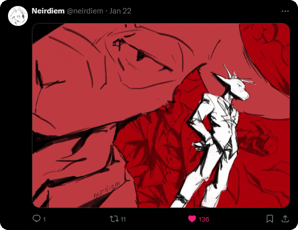
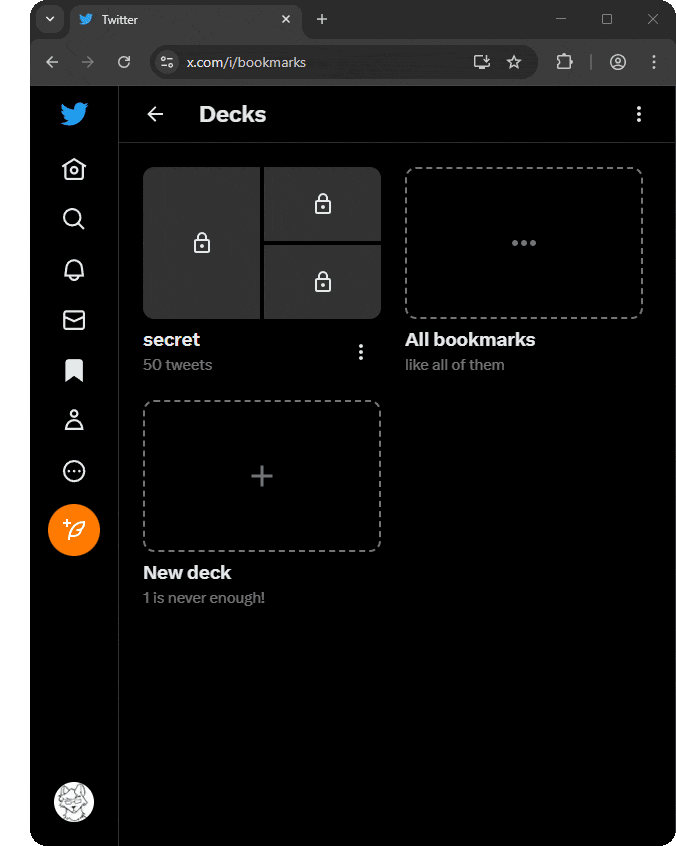
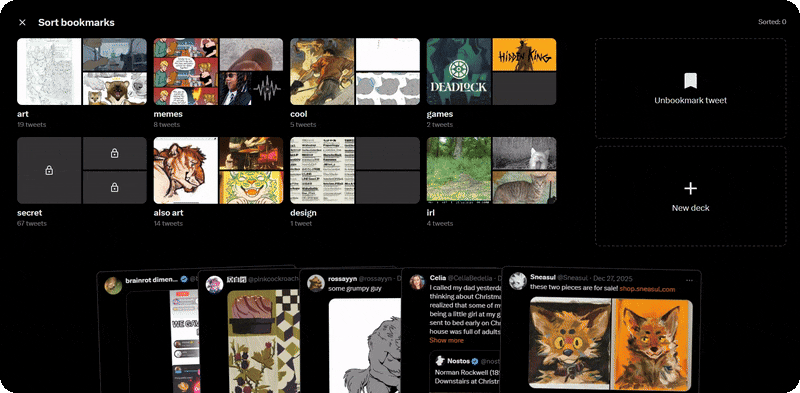
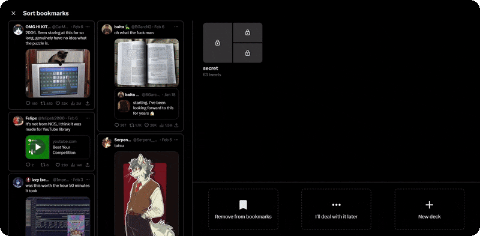
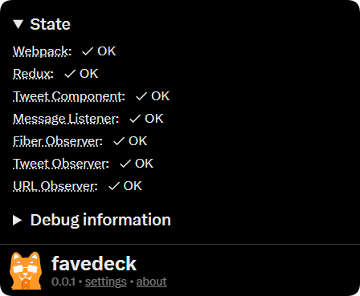
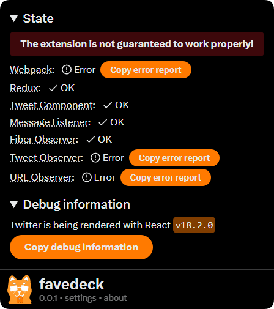

<h1 align="center">
    
    <br/>
    favedeck
</h1>

<p align="center">
    <a href="https://http.cat/404"></a>
    <a href="https://http.cat/404"></a>
</p>

<p align="center">
    <a href="docs/faq.md">FAQ</a>
    ◆
    <a href="docs/technicalities.md">Technicalities</a>
</p>

**favedeck** <sup>(stylized in lowercase)</sup> is a browser extension that adds "decking" functionality similar to Pinterest's boards for Twitter bookmarks.

> [!WARNING]
> favedeck is very much in its infancy and hasn't been "battle-tested" so to say. I'd appreciate any sort of feedback and/or contributions!

## Contents

- [Features](#features)
- [Motivation/Implementation](#motivationimplementation)
- [Compatibility](#compatibility)
- [Limitations](#limitations)
- [TODO](#todo)
- [Issues/Contributing](#issuescontributing)
- [Licensing and Thank Yous](#licensing-and-thank-yous)

## [Features](#features)



### Deck tweets

Upon pressing the bookmark button, you'll now be prompted to add the tweet to one or more decks.

> [!NOTE]
> This isn't a requirement; tweets are still bookmarked when you press the button, though you _will_ save time by doing the sorting beforehand.

<br clear="right"/><br/>


### Organize

The "Bookmarks" page is now the "Decks" page. Here you can view, reorder, and explore the decks you've created.

You can also view all bookmarks as you normally would by pressing the "All bookmarks" button, or create new ones by pressing "New deck".

Tweets inside decks can also be reordered, "undecked" (removed from said deck), or added/moved to other decks.

> [!IMPORTANT]
> At the moment, there are some limitations on how tweets can be re-ordered. [You can read about them here.](docs/faq.md#i-cant-reorder-some-tweets-in-the-deck)

<br clear="left"/><br/>



### Private, really

favedeck makes **zero** requests when decking tweets. Everything is stored locally.

It's also possible to export decks if you wish to transfer them to another device.

[You can read more about this in the Privacy Policy.](PRIVACY.md)

> [!NOTE]
> Automatically syncing decks between devices/accounts is not supported. 
> 
> Partially because this would require hosting a server (which I don't have the resources for), and partially because this would raise a lot more privacy concerns.

<br clear="right"/><br/>

### <h3 align="center">Sort existing bookmarks</h3>
<p align="center">Organize tweets from your bookmarks with silly interactive interfaces!</p>

<div align="center">
    
    <br/>
    
</div>
<br/>
<p align="center"><i>and more stuff I probably forgot to include...</i></p>

## [Motivation/Implementation](#motivation-implementation)

My primary use of Twitter is to find art inspiration. Over the last 2 years I have accumulated about 6000 bookmarks and it became too cumbersome to search for a specific tweet or author.

Previously, [I made a different extension for downloading bookmarks](https://github.com/nedoxff/booksave), but that still leaves one with a folder of 6000 images with no categorization whatsoever, so favedeck felt like the next logical step.

While there are other extensions with similar functionality to favedeck, their core feature is either a) aggregating bookmarks from different social medias or b) syncing bookmarks between devices/accounts.

In contrast, favedeck hacks directly into the Twitter website and changes UI elements around so that the extension feels as part of Twitter itself. While that is the most fragile and unstable method of doing it, I felt like that would be an acceptable tradeoff.

> [!TIP]
> You can check whether anything broke by using the popup:
>
> 

## [Compatibility](#compatibility)

favedeck is compatible with all major browsers except Safari since I don't have a job and can't pay Apple $100/year to publish the extension to their store. Otherwise, Firefox and Chromium-based browsers released at most a year ago *should* work.

favedeck **is** compatible with:

- [Control Panel for Twitter](https://github.com/insin/control-panel-for-twitter)

favedeck **is NOT** compatible with:

- [OldTwitter](https://github.com/dimdenGD/OldTwitter) (it's a separate Twitter client)

If you encounter any issues while using other Twitter-related extensions, please [report them](#issuescontributing)!

## [Limitations](#limitations)

### Ratelimits

Some functionality of favedeck depends on Twitter's API (e.g. fetching the bookmarks timeline, as well as unbookmarking tweets), which has a ratelimit of about **500 requests per 15 minutes** nearly on *all* methods.

Due to this, some features of favedeck are also ratelimited, and some stuff in [TODO](#todo) might be delayed due to implementation complexities. [You can read more about this in The Technicalities.](docs/technicalities.md#ratelimits)

## [TODO](#todo)

There are some things I'd like to implement in the future but chose not to for the first version of the extension:

<details>
    <summary>Importing decks between different accounts</summary>

> Due to Twitter's ratelimits there's no simple way of transferring bookmarks between different accounts if there are more than 500 of them (besides, if you get close to sending hundreds of requests per second I'm sure Twitter's servers are likely to ban the account, but I don't want to test that).
> 
> One solution I had in mind is to "fake" the bookmarks, so that they would appear in the decks but not in the "All bookmarks" section, but that seems more like a hack than a solution.
</details>

<details>
    <summary>Downloading decks (similar to <a href="https://github.com/nedoxff/booksave">booksave</a>)</summary>

> Actually easier to implement than in booksave since favedeck caches the entities of all tweets in IndexedDB. Probably the most likely feature to get implemented in the next version.
</details>

<details>
    <summary>Selecting multiple tweets in a deck (and actions with them, e.g. move, undeck, etc.)</summary>

> The "selecting" part is harder than the "actions" part. I'm really stubborn about this since I've barely used this feature in Pinterest.
</details>

<details>
    <summary><a href="docs/faq.md#i-cant-reorder-some-tweets-in-the-deck">Proper reordering of tweets in Masonry mode</a></summary>

> Not exactly sure how to implement it but there was one idea of using an array of "order"s instead of a singular value like it's currently implemented (the order value controls where the tweet and all its images are located, so they're kind of inseparable)
</details>

<details>
    <summary>Detect ratelimits?</summary>

> I don't know whether this is actually needed. I guess it will be when importing/exporting is implemented? Also the extension probably won't have access to the response headers...
</details>

<details>
    <summary>Translations (i18n)</summary>

> Will require reworking a lot of the code, but if there will be demand for it I'll definitely implement community-made translations with [lingui](https://lingui.dev).
</details>

If you have any suggestions or potential feature ideas, please [submit them](#issuescontributing)!

## [Issues/Contributing](#issuescontributing)

You can submit issues/suggestions via [the issue tracker](https://github.com/nedoxff/favedeck/issues) or by contacting me:

- [Twitter](https://x.com/nedodraws)
- [Bluesky](https://bsky.app/profile/nedoxff.bsky.social)
- [Email (I guess?)](mailto:nedoxff@proton.me)

> [!TIP]
> It is **highly** recommended (if not required) to include the debug information when submitting a bug report. Whenever something breaks in the extension, you'll get the option to copy the error report in the popup:
> 
> 
>
> If nothing is broken, you can still get some useful stuff by pressing "Copy debug information", which is always present.

### Contributing

You'll need `nodejs (>= 22.14.0)` and `pnpm (>= 10.7.0)`.

- Clone the repository:

```
git clone https://github.com/nedoxff/favedeck
```

- Install dependencies:

```
cd favedeck
pnpm i
pnpm approve-builds
pnpm postinstall
```

- Start developing!

```bash
pnpm dev    # Launches a Chrome instance with the extension.
            # Development mode with Firefox is (currently) not supported.
```

<details>
    <summary>Optional (but recommended): Setup web-ext</summary>

> Every time you restart the project via `pnpm dev`, the Chrome profile will be reset and you'll have to relogin into Twitter. To persist the Chrome profile, create a file named `web-ext.config.ts` in the root of the project with the following contents:

```ts
import { resolve } from 'node:path';
import { defineWebExtConfig } from 'wxt';

export default defineWebExtConfig({
  binaries: {
    // path to chrome.exe, e.g.
    chrome: "C:\\Program Files\\Google\\Chrome Beta\\Application\\chrome.exe"
  },
  // this will create a profile in the project directory,
  // but you can technically change it to one of your profiles.
  //                         ↑ (this hasn't been tested)
  chromiumProfile: resolve(".wxt/chrome-data"),
  keepProfileChanges: true,
  // optional, but I don't see why someone wouldn't want to have this...
  startUrls: ["https://x.com"],
});
```

> This can also be useful if `wxt` can't find a Chromium instance to use by default.

</details>

> [!WARNING]
> Please read [The Technicalities](docs/technicalities.md) before touching the code.

## [Licensing and Thank Yous](#licensing-and-thank-yous)

favedeck is open-source software licensed under [AGPL-3.0](LICENSE).

Thank you:

- My friends for keeping me sane
- [Open-source authors for making this extension possible](package.json)
- The authors of React Developer Tools and [this Webpack reverse engineering guide](https://gist.github.com/0xdevalias/8c621c5d09d780b1d321bfdb86d67cdd)
- You :<wbr/>)