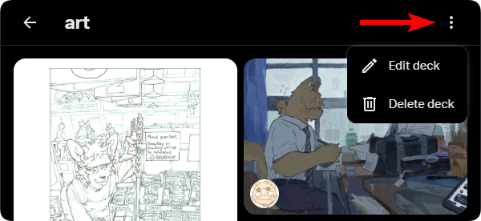
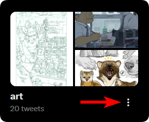
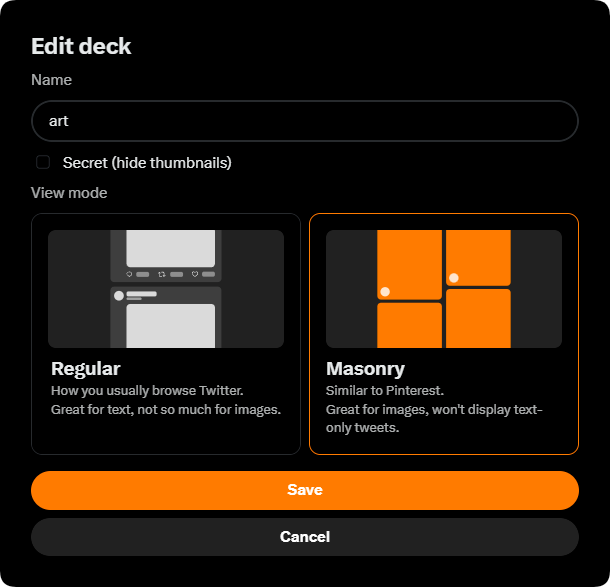

## [How do I get that Pinterest view like in the README?](#how-do-i-get-the-pinterest-view-like-in-the-readme)

You can change the deck's view mode by pressing the three dots either in the Decks page or inside the deck itself and then "Edit deck":

    
    

    

## [I can't reorder some tweets in the deck?](#i-cant-reorder-some-tweets-in-the-deck)

> [!NOTE]
> This doesn't apply to the Default view mode.

There are some quirks with reordering tweets when using Masonry view mode.

- If a tweet consists of multiple images, they cannot be reordered with each other (the order will reset upon reloading the page).

> This is fix-able and is currently in the [TODOs](../README.md#todo).